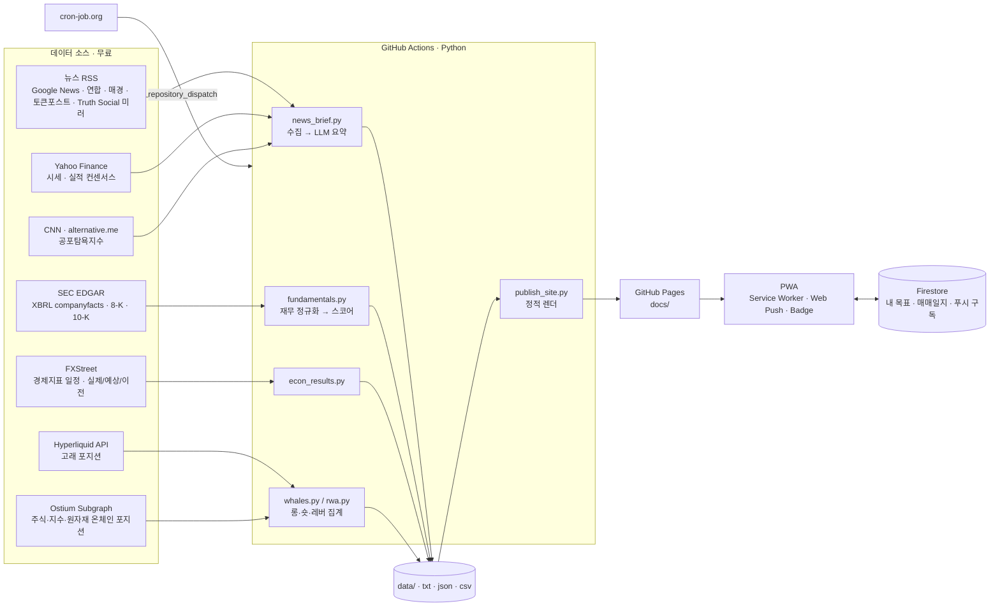

# MARKET BRIEF — 서버 없이 돌아가는 경제 브리핑 데이터 파이프라인 & PWA

[](#기술-스택)
[](#스케줄링-신뢰성)
[](https://kkkkkijun.github.io/stock_news_mailer/)
[](#ax-llm을-어디에-어떻게-썼나)
[](#pwa--알림)

> **라이브:** https://kkkkkijun.github.io/stock_news_mailer/
> 매일 06:30 / 17:00(KST) 국내외 경제·해외주식·코인·부동산 뉴스를 수집·요약해 정적 웹앱으로 발행하고, 폰에 푸시로 알려주는 **무인 운영 파이프라인**입니다.
> 서버 0대, 월 운영비 약 $2~6(LLM 호출만 유료), 나머지 데이터 소스 15개는 전부 무료 공개 API/RSS.


---

## 목차
1. [1분 요약](#1분-요약)
2. [폴더 지도](#폴더-지도)
3. [로컬에서 돌려보기](#로컬에서-돌려보기)
4. [어디를 고치면 무엇이 바뀌나](#어디를-고치면-무엇이-바뀌나)
5. [동작 흐름 한 장 (아키텍처)](#동작-흐름-한-장-아키텍처)
6. [데이터 파이프라인 (Data Engineering)](#데이터-파이프라인-data-engineering)
7. [분석 로직 (Data Analysis)](#분석-로직-data-analysis)
8. [AX: LLM을 어디에, 어떻게 썼나](#ax-llm을-어디에-어떻게-썼나)
9. [운영 중 겪은 문제와 해결](#운영-중-겪은-문제와-해결)
10. [PWA · 알림](#pwa--알림)
11. [기술 스택](#기술-스택)
12. [저장소 구조](#저장소-구조)
13. [로드맵](#로드맵)
14. [개발·검증](#개발검증)
15. [검증 방법](#검증-방법)

---

## 1분 요약

매일 아침 뉴스·실적·경제지표·온체인 포지션을 여러 사이트에서 따로 확인하는 시간을 없애려고 만들었습니다. 처음엔 이메일 발송 스크립트 하나였고, 운영하면서 정적 사이트 → PWA → 실적/재무 분석 → 온체인 포지션 지도 → 경제지표 결과 반영으로 넓어졌습니다.

- **무엇을 하나**: 뉴스·실적·경제지표·온체인 포지션을 수집해 OpenAI로 요약하고, 결과를 `docs/`에 정적 페이지로 발행합니다.
- **언제 도나**: 뉴스 브리핑 2회/일(06:30, 17:00 KST) · 실적 리프레시 4회/일 · 포지션 지도 1회/시간. 트리거는 cron-job.org → GitHub `repository_dispatch`.
- **얼마 드나**: 월 약 $2~6(OpenAI 요약·번역·리포트 생성만 유료, 나머지 데이터 소스 15개는 전부 무료).
- **산출물은 어디**: `docs/`(GitHub Pages로 서빙되는 정적 HTML/JSON). 브리핑 원문은 `data/`에 회차별로 누적됩니다.
- **규모**: Python 약 5,800줄 · JavaScript 약 850줄.

## 폴더 지도

| 경로 | 역할 | 누가 건드리나 |
|---|---|---|
| `main.py` | 오케스트레이터(얇음). 수집 → 요약 → 발행 → 푸시 흐름 전체와 `refresh` 모드를 아래 모듈에 위임해 호출만 한다 | 사람 |
| `settings.py` | 설정 단일 출처. 환경변수 로딩, 시간대, 티커 목록(`TICKER_NAMES`)/`EARNINGS_TICKERS`/`_EARN_KO`, `configure_logging()` | 사람 |
| `llm.py` | OpenAI 클라이언트 생성 + 뉴스 요약(main.py에서 분리) | 사람 |
| `newsfeed.py` | 티커별 뉴스 기사 수집(Yahoo Finance RSS + Google News RSS) | 사람 |
| `netutil.py` | HTTP 공통 헬퍼(타임아웃 기본값, 일시 오류 재시도, JSON 디코딩) | 사람 |
| `quotes.py` | Yahoo Finance 시세 수집과 `docs/prices.json` 생성 | 사람 |
| `earnings.py` | Yahoo 실적 일정·컨센서스(`data/earnings.json`) + SEC 8-K 기반 실적 리포트(`data/reports.json`) | 사람 |
| `sec.py` | SEC EDGAR 접근 헬퍼(CIK 조회, 8-K 보도자료 본문) | 사람 |
| `news_brief.py` + `topic_briefing.py`/`realestate_briefing.py`/`trump_briefing.py` | 뉴스 수집·요약 공통 엔진(`news_brief.py`) + 주제별 설정 3종(쿼리·피드·문구만 다름) | 사람 |
| `fundamentals.py` | SEC XBRL 기반 성장주 스코어 산출, 10-K 정성 분석 | 사람 |
| `econ_results.py` | FXStreet 경제지표 실제/예상/이전 수집 | 사람 |
| `rwa.py` | Ostium 온체인 포지션(주식·지수·원자재) 집계 | 사람 |
| `whales.py` | Hyperliquid 고래 포지션 집계 | 사람 |
| `publish_site.py` | 호환 파사드. 실제 구현은 `render/` 패키지이며, 기존 `import publish_site` 경로를 유지하기 위해 재노출만 한다 | 사람 |
| `render/` | 정적 사이트 렌더링 구현(`publish_site.py`가 위임). `config.py`(경로·상수) · `common.py`(공용 헬퍼) · `parse.py`(본문 파싱) · `files.py`(저장/로드) · `layout.py`(페이지 셸·CSS·`render_html`) · `schedule.py`(경제지표 일정) · `earnings.py`(실적 탭) · `news.py`(뉴스 카드) · `growth.py`(성장주 탭) · `rwamap.py`(지도 탭) · `archive.py`(아카이브 인덱스) · `assets.py`(정적 자산 기록) · `clock.py`(현재 시각) · `publish.py`(발행/재렌더링) | 사람 |
| `notify.py` | 브리핑 완료 알림(앱 푸시 + 선택 이메일) | 사람 |
| `push_send.py` | Firestore 구독자에게 Web Push 발송 | 사람 |
| `data/` | 수집 원문(`*.txt`)·시세(`*.quotes.json`)·재무(`fundamentals.json`)·경제지표(`econ_results.json`) | **생성물**, 봇이 커밋(직접 편집하지 않음). 단 `data/econ/YYYY-MM.csv`(캘린더 원본)는 사람이 월별로 추가 |
| `docs/` | GitHub Pages 산출물(`index.html`, `whales.json`, `rwamap.json`, `prices.json` 등) + 수작업 자산(`goal-app.js`, `push.js`, `sw.js`, `manifest.webmanifest`, `flags/`, `assets/`) | 산출물은 **생성물**(봇이 커밋, 직접 편집하지 않음). `goal-app.js`·`push.js`·`sw.js`·`manifest.webmanifest`·`flags/`·`assets/`만 사람이 직접 관리 |
| `docs/archive/` | 회차 스냅샷(`YYYY-MM-DD-am.html` 등)과 날짜 캘린더 | **생성물**, 봇이 커밋(직접 편집하지 않음) |
| `.github/workflows/` | `briefing.yml`(뉴스 브리핑) · `earnings-refresh.yml`(실적) · `map-refresh.yml`(지도) | 사람 |
| `airflow/` | 같은 파이프라인을 재현한 선택적 오케스트레이션 레이어(로컬/Codespaces 프로토타입, 운영에는 미사용). 두 DAG 공통 로직은 `airflow/dags/_common.py` | 사람 |
| `tools/` | 선택 실행 보조 도구(`tools/store.py`: 브리핑 SQLite 파생 인덱스) | 사람 |
| `tests/` | 단위 테스트 + 골든 렌더 회귀 도구. `conftest.py`(sys.path 설정) · `test_parse.py`(본문 파싱) · `test_common.py`(공용 헬퍼) · `test_econ_fmt.py`/`test_fundamentals_pure.py`/`test_netutil.py`/`test_quotes_order.py`(각 모듈 순수 로직) · `test_golden_determinism.py`(rebuild_all 결정성) · `golden_render.py`(고정 시각 전체 렌더 하네스) · `normalize_html.py`(정규화 비교 헬퍼) | 사람 |
| `requirements-dev.txt` | 테스트 실행에 필요한 개발 의존성(pytest 등) | 사람 |
| `legacy/` | 대체된 구버전 구현, 참고용으로만 보관하며 서빙되지 않음 | 아무도 건드리지 않음(참고용) |
| `.env.template` | 필요한 환경변수와 기본값·설명을 모아둔 템플릿(실제 값은 로컬 `.env`나 GitHub Secrets에) | 사람 |

## 로컬에서 돌려보기

```bash
pip install -r requirements.txt
cp .env.template .env        # 최소한 OPENAI_API_KEY만 채우면 동작
DRY_RUN=1 python main.py     # 발송·발행 없이 본문만 콘솔에 출력해 확인
```

그 외 자주 쓰는 명령:

```bash
python main.py refresh                    # LLM 없이 실적·시세·보고서만 갱신 후 재렌더
python rwa.py refresh                     # 주식·지수·원자재 포지션 스냅샷
python whales.py refresh                  # Hyperliquid 고래 스냅샷
python econ_results.py                    # 경제지표 실제/예상/이전 수집
python tools/store.py stats               # 브리핑 SQLite 색인 현황
python tests/golden_render.py <out_dir>   # 골든 렌더(회귀 확인용, 아래 "검증 방법" 참고)
```

환경변수(`.env.template`과 동기화된 전체 목록)

**필수**

| 변수 | 용도 | 기본값 |
|---|---|---|
| `OPENAI_API_KEY` | 뉴스 요약·정성 분석 등에 사용 | 없음(반드시 설정) |

**알림 (앱 푸시 · 선택 이메일)**

| 변수 | 용도 | 기본값 |
|---|---|---|
| `VAPID_PRIVATE_KEY` | 웹 푸시용 VAPID 비공개키(PEM) | 없음(없으면 푸시는 조용히 건너뜀) |
| `VAPID_SUBJECT` | VAPID 클레임의 연락처(`mailto:...`) | `mailto:admin@example.com` |
| `SITE_URL` | 브리핑 알림에 담을 사이트 URL | `https://kkkkkijun.github.io/stock_news_mailer/` |
| `SEND_EMAIL` | 1이면 앱 푸시 외에 이메일도 발송(선택) | `0`(꺼짐) |
| `EMAIL_USER` / `EMAIL_PASS` | 이메일 발신 계정(Gmail)/앱 비밀번호. `SEND_EMAIL=1`일 때만 사용 | 없음 |
| `EMAIL_RECIPIENTS` | 이메일 수신자(콤마 구분). `SEND_EMAIL=1`일 때만 사용 | `seo930714@gmail.com,mjikshouse@naver.com` |

**파이프라인 옵션**

| 변수 | 용도 | 기본값 |
|---|---|---|
| `PUBLISH_SITE` | 웹사이트(`docs/index.html`) 발행 여부, 0이면 건너뜀 | `1` |
| `DRY_RUN` | 발송/발행 없이 본문만 콘솔 출력(테스트용) | 없음(꺼짐) |
| `OPENAI_SUMMARY_MODEL` | 요약에 쓰는 OpenAI 모델 | `gpt-4o-mini` |
| `OPENAI_SUMMARY_MAX_TOKENS` | 요약 응답의 최대 토큰 수 | `500` |
| `STOCK_TICKERS` | 추적할 주식 티커(콤마 구분) | `NVDA,TSLA,HIMS,RDW,IREN,RKLB` |
| `CRYPTO_TICKERS` | 추적할 코인 티커(콤마 구분) | `BTC-USD,ETH-USD,SOL-USD,BMNR` |
| `NEWS_PER_TICKER` | 티커별 최대 뉴스 개수 | `3` |
| `USE_ARTICLE_BODIES` | 기사 원문 본문을 2단계 요약에 붙일지(1=사용) | `1` |
| `ARTICLE_BODY_CHARS` | 기사 원문에서 잘라 쓸 최대 글자 수 | `1500` |
| `ARTICLE_FETCH_TIMEOUT` | 기사 원문 요청 타임아웃(초) | `12` |
| `REALESTATE_TOP_N` | 부동산 브리핑에 담을 최대 항목 수 | `6` |
| `REALESTATE_POOL_PER_QUERY` | 부동산 브리핑 쿼리당 후보 풀 크기 | `30` |
| `TOPIC_TOP_N` | 토픽(경제·코인) 브리핑에 담을 최대 항목 수 | `5` |
| `TOPIC_POOL_PER_QUERY` | 토픽 브리핑 쿼리당 후보 풀 크기 | `30` |
| `TRUMP_FEED_URL` | 트럼프 브리핑 RSS 피드 URL | `https://trumpstruth.org/feed` |
| `TRUMP_MAX_POSTS` | 트럼프 브리핑에서 훑어볼 최대 게시물 수 | `25` |
| `TRUMP_TOP_N` | 트럼프 브리핑에 담을 최대 항목 수 | `6` |
| `TRUMP_MAX_AGE_HOURS` | 브리핑에 반영할 게시물의 최대 경과 시간(시간 단위) | `24` |
| `PIPELINE_REPO` | (Airflow 전용) 파이프라인 저장소 경로 | `/opt/airflow/repo` |

## 어디를 고치면 무엇이 바뀌나

| 하고 싶은 것 | 건드릴 곳 |
|---|---|
| 주식/코인 티커 추가 | `settings.py`의 `STOCK_TICKERS`/`CRYPTO_TICKERS` 기본값과 `TICKER_NAMES`; 배지 색은 `render/config.py`의 `TICKER_COLORS`, 한글명은 `_TICKER_KO` |
| 경제지표 캘린더 월 추가 | `data/econ/YYYY-MM.csv` 새로 추가; 이벤트명 한글 번역은 `render/schedule.py`의 `_ECON_KO` |
| 지표 노출 국가 변경 | `render/config.py`의 `_ECON_CCY`(현재 미국·한국·일본만 화이트리스트) |
| 뉴스 파트/탭 추가 | `render/config.py`의 `PARTS`, `TABS`, `HERO_PARTS` |
| 화면 스타일 변경 | `render/layout.py`의 `CSS`(빌드 시 `docs/assets/site.css`로 기록됨) |
| 실적 일정에 종목 추가 | `settings.py`의 `EARNINGS_TICKERS`, `_EARN_KO` |
| 성장주 스코어 가중치 조정 | `fundamentals.py`의 `_axes()` |
| 브리핑 발행 시각 변경 | cron-job.org의 잡 설정 + (Airflow 레이어를 쓴다면) `airflow/dags/daily_briefing.py`의 `schedule` |
| 푸시 알림 문구 변경 | `notify.py`의 `notify_briefing()` |
| 사이트 제목/슬로건/목표일 변경 | `render/config.py`의 `SITE_TITLE`, `SLOGAN`, `DDAY_TARGET` |

## 동작 흐름 한 장 (아키텍처)



설계 원칙
- **수집과 렌더를 분리**: 수집 결과는 항상 파일(`data/`)로 남기고, 렌더는 그 파일만 읽습니다. 그래서 `rebuild_all()`로 **LLM 호출 없이** 과거 90회분 페이지를 언제든 재생성할 수 있습니다(멱등).
- **부분 실패 격리**: 섹션(경제·코인·부동산·트럼프·실적·지도) 단위로 `try/except`. 소스 하나가 죽어도 그날 브리핑은 나갑니다. LLM 키가 없으면 헤드라인 나열로 폴백.
- **정적 산출물**: 서버 없이 JSON+HTML만 배포. 클라이언트(브라우저)가 `whales.json`·`rwamap.json`·`prices.json`을 읽어 렌더합니다.

## 데이터 파이프라인 (Data Engineering)

### 모듈별 역할

| 모듈 | 입력 | 처리 | 출력 |
|---|---|---|---|
| `main.py` | 환경변수, 아래 모듈 | 오케스트레이션(수집→요약→발행→푸시), `refresh` 모드(LLM 없이 실적/시세만). 로직은 각 모듈로 분리된 **얇은** 진입점 | `docs/index.html`, 푸시 |
| `settings.py` | 환경변수(.env/Secrets) | 티커·모델·시간대 등 설정값 로딩 단일화, `configure_logging()` | 설정 상수, 로거 설정 |
| `llm.py` | `OPENAI_API_KEY`, 요약 대상 텍스트 | OpenAI 클라이언트 생성, 한국어 요약 | 클라이언트, 요약 문자열 |
| `newsfeed.py` | Yahoo Finance RSS, Google News RSS | 티커별 기사 수집(발행시간 역순) | 기사 목록 |
| `netutil.py` | requests 인자(url/headers/params 등) | 타임아웃 기본값 적용, 일시 오류(연결 오류·429·5xx) 재시도(backoff) | `requests.Response` 또는 파싱된 JSON |
| `quotes.py` | Yahoo Finance chart API | 시세 조회 | 시세 dict, `docs/prices.json` |
| `earnings.py` | Yahoo quoteSummary, `sec.py`(8-K), `quotes.py`, `newsfeed.py` | 실적 일정·컨센서스 정리, 8-K 기반 AI 리포트 생성 | `data/earnings.json`, `data/reports.json` |
| `sec.py` | SEC EDGAR 공개 API | CIK 조회, 최근 8-K(Item 2.02) 보도자료 본문 추출 | CIK, 8-K 본문 |
| `news_brief.py` (+ `topic_briefing.py`, `realestate_briefing.py`, `trump_briefing.py`) | Google News RSS + 언론사 RSS | 발견(폭넓은 쿼리) → 근거(언론사 리드 문단) → 2단계 요약. 주제 모듈은 **설정만** 담고 로직은 공유 | 섹션 텍스트 |
| `fundamentals.py` | SEC XBRL companyfacts, 10-K | 태그 드리프트 보정, Q4 유도(연간−3분기), TTM, 성장 스코어 | `data/fundamentals.json`, `data/qual_cache.json` |
| `econ_results.py` | FXStreet 캘린더 API | 높음(HIGH) 지표만, CSV `Id`와 API `id` **정확 매칭**, 단위(`%`,`$`)·배수(`K/M/B`) 조립 | `data/econ_results.json` |
| `whales.py` | Hyperliquid leaderboard · clearinghouseState | 상위 90 지갑 선별(자산+누적 PnL) → 코인별 롱/숏/레버 집계 | `docs/whales.json` |
| `rwa.py` | Ostium 서브그래프(Arbitrum) | 1,000건 페이지네이션, `USD = collateral/1e6 × leverage/100`, 카테고리 분류(주식·지수·원자재·암호화폐), 외환·채권 제외 | `docs/rwamap.json` |
| `publish_site.py` (→ `render/`) | `data/*` | 호환 파사드(`publish_site.py`)가 실제 구현체인 `render/` 패키지로 위임해 서버사이드 HTML 렌더(UTC→KST, 탭·아카이브·일정·지도·성장주) | `docs/**/*.html` |
| `tools/store.py` | `data/*.txt`, `*.quotes.json` | 브리핑 원문을 SQLite로 색인하는 **파생 인덱스**(원 파이프라인과 무관하게 선택 실행) | `data/briefings.db` |
| `push_send.py` | Firestore `push_subs`, VAPID 키 | Web Push 발송, 404/410 구독 자동 정리 | 폰 알림 + 배지 |
| `notify.py` | `main.py`의 발행 결과 | 브리핑 알림: 앱 푸시(항상) + 이메일(`SEND_EMAIL=1`일 때만, 선택) | 푸시 알림, (선택) 이메일 |
| `docs/goal-app.js` | Firestore(사용자별) | 입출금·매매 기록, **FIFO 로트 매칭**으로 실현손익·승률·손익비·평균보유일, 현금 비중 | 내 목표 탭 |

### 스케줄링 신뢰성
GitHub Actions의 `schedule` 크론은 best-effort라 **2~6시간 지연·누락**이 실제로 발생했습니다.
해결: 외부 크론(cron-job.org, 무료) → GitHub `repository_dispatch` → 워크플로 실행. 뉴스 브리핑은 이 경로로만 돌고, 워크플로의 `schedule:`은 제거했습니다.

```yaml
on:
  workflow_dispatch:
  repository_dispatch:
    types: [news-briefing]
```

### 데이터 품질 장치
- **XBRL 태그 드리프트**: 같은 회사도 연도에 따라 `Revenues` ↔ `RevenueFromContractWithCustomer…` 태그가 바뀝니다. 후보 태그 중 **가장 최신 종료일을 가진 태그**를 고르도록 `_pick()`을 짰습니다. (NVDA 매출이 $3,105M(2020 태그)로 잡히던 오류 → $81,615M로 정정)
- **Q4 결측**: 10-K에는 연간만 있어 4분기 흐름값이 비는 문제를 `연간 − (Q1+Q2+Q3)`로 유도.
- **시간 기준 분리**: 브리핑 본문은 "발행 시각", 일정·D-day 등 시간 의존 UI는 "실제 현재 시각"으로 렌더. 재빌드 때 결과가 과거로 되돌아가는 버그를 이렇게 막았습니다.
- **소스 검증 선행**: 새 소스는 코드 전에 실호출로 스키마·인증·경계값을 확인(Ostium 1,603포지션 집계 검증, FXStreet id 매칭 검증).

## 분석 로직 (Data Analysis)

### 성장주 스크리너 (SEC 재무 기반)
"우량주가 아니라 **성장 궤도**에 있는 기업"을 찾는 것이 목적이라 성장 축에 가중을 둡니다.

| 축 | 지표 | 가중 |
|---|---|---|
| 성장 (g) | 매출 YoY (25%↑ 녹색 / 12%↑ 노랑) | **0.42** |
| 수익성 (p) | 영업이익률, 적자면 **적자폭 개선 속도** | 0.20 |
| 재무 (b) | 순현금/순부채, 부채 증가 시 CapEx 브리지 | 0.16 |
| 지속성 (s) | 주식 희석률, FCF | 0.22 |

`score = 0.42g + 0.20p + 0.16b + 0.22s`, 단 **저성장 게이트**(YoY < 12% → 최대 50점, < 22% → 최대 72점)로 수익성·재무 만점인 대형 우량주가 상위권을 점하지 못하게 했습니다.
해자(moat)는 처음 LLM 주관 점수를 썼다가 값이 85점 근처로 몰리는 문제가 있어, **매출총이익률 수준·안정성·추세**로 만든 정량 프록시로 교체했습니다(설명 가능성 확보).

### 경제지표 결과 표기 원칙
발표된 높음 지표는 `실제 / 예상 / 이전`과 함께 `▲ 상회 / ▼ 하회 / = 부합`을 붙입니다.
이는 **예상치 대비 숫자 방향**일 뿐 좋다·나쁘다 판단이 아님을 UI에 명시했습니다(실업률 ▲는 악화). 소스가 주는 `isBetterThanExpected`가 자주 비어 있어 방향만 표기하는 쪽이 정직하다고 판단했습니다.

### 온체인 포지션 지도
- 암호화폐: Hyperliquid 상위 90 지갑의 실제 포지션(고래).
- 주식·지수·원자재: Ostium 전체 오픈 포지션(고래 필터 아님, 라벨로 구분).
- 자산별 **순롱 비율 × 평균 레버리지**를 4분면 버블맵(d3-force)으로 시각화. 색은 국내 관례(빨강=롱/상승, 파랑=숏/하락).

### 매매일지
FIFO 로트 매칭으로 청산 매매를 자동 생성하고 실현손익·승률·손익비·평균수익률·평균보유일을 계산합니다. 평균단가·실현손익은 체결가 기준(수수료 별도)으로 증권사 표기와 일치시켰습니다.

## AX: LLM을 어디에, 어떻게 썼나

| 용도 | 모델 | 가드레일 |
|---|---|---|
| 뉴스 요약(오늘 한눈에 / 핵심 / 흐름·전망) | gpt-4o-mini | 언론사 리드 문단을 근거로 제공, 원문 링크·출처·시각 유지, 실패 시 헤드라인 폴백 |
| 트럼프 발언 번역·요약 | gpt-4o-mini | "트럼프의 주장"임을 명시, 광고·재게시 제거, 단일 소스 실패 시 섹션 비움 |
| 실적 리포트 생성 | gpt-4o-mini | SEC 8-K 보도자료 원문 + Yahoo 컨센서스 수치를 입력, 실제/예상 비교는 코드로 계산 |
| 10-K 정성 분석(사업·확장성·리스크) | gpt-4o-mini | JSON 스키마 강제, **캐시**로 종목당 1회만 호출 |

원칙: **숫자는 코드가, 문장은 LLM이.** 점수·비율·상회/하회 판정처럼 검증 가능한 것은 LLM에 맡기지 않았고, LLM 산출물은 항상 원문 링크와 함께 보여줍니다. 비용은 사용량 한도로 상한을 걸어 운영합니다.

## 운영 중 겪은 문제와 해결

| 문제 | 원인 | 해결 |
|---|---|---|
| 알림은 왔는데 사이트가 갱신되지 않음 | 로컬의 오래된 워크플로 파일이 원격을 덮어써 "발행 커밋" 스텝이 사라짐 | 워크플로 복구 + 생성물 커밋은 소스 커밋과 분리하는 규칙 |
| 아침 브리핑이 2~6시간 늦음 | GitHub `schedule` 크론의 best-effort 특성 | 외부 크론 → `repository_dispatch` |
| NVDA 매출이 30억 달러로 표시 | XBRL 태그 드리프트(구 태그의 2020년 값) | 최신 종료일 기준 태그 선택 |
| 실적 리프레시 후 지표 결과가 사라짐 | 재빌드가 저장된 브리핑 시각을 `now`로 재사용 | 시간 의존 블록만 실시간 계산 |
| 다른 계정이 기여자에 표시 | 커밋 author 이메일 오설정 | `filter-branch`로 이력 정정 + 자격증명 헬퍼 정리 |

## PWA · 알림
- `manifest.webmanifest` + `sw.js`(network-first, 오프라인 시 캐시 폴백)로 홈 화면 설치.
- iOS 안전영역(`env(safe-area-inset-*)`) 대응.
- Web Push(VAPID) + Badge API: 브리핑 발행 시 배지·팝업. 구독은 Firestore에 저장, 🔔 버튼으로 토글. 발송은 `push_send.py`, 발행 후 알림 트리거는 `notify.py`가 맡고, 이메일은 `SEND_EMAIL=1`일 때만 함께 나가는 선택 경로입니다.

## 기술 스택
Python 3 · feedparser · requests · trafilatura · pywebpush · python-dotenv · OpenAI SDK
GitHub Actions · GitHub Pages · Firebase Auth/Firestore · Service Worker · Web Push · d3-force · SQLite

## 저장소 구조

```
.
├── main.py                 # 오케스트레이션(얇음) · refresh 모드 · 푸시
├── settings.py             # 설정 단일 출처(환경변수·티커·configure_logging)
├── llm.py                  # OpenAI 클라이언트 · 뉴스 요약
├── newsfeed.py             # 티커별 뉴스 기사 수집
├── netutil.py              # HTTP 공통 헬퍼(타임아웃·재시도)
├── quotes.py               # Yahoo Finance 시세 · docs/prices.json
├── earnings.py             # 실적 일정·컨센서스 · 8-K 리포트
├── sec.py                  # SEC EDGAR 헬퍼(CIK · 8-K 본문)
├── news_brief.py           # 뉴스 수집/요약 공통 엔진
├── topic_briefing.py       # 경제·코인시장 (설정)
├── realestate_briefing.py  # 부동산 (설정)
├── trump_briefing.py       # Truth Social 번역·요약
├── fundamentals.py         # SEC XBRL → 성장 스코어 · 10-K 정성
├── econ_results.py         # FXStreet 지표 결과
├── whales.py / rwa.py      # 온체인 포지션 집계
├── publish_site.py         # 호환 파사드(실제 구현은 render/)
├── render/                 # 정적 사이트 렌더링 구현(config·parse·files·layout·schedule·earnings·news·growth·rwamap·archive·assets·clock·publish)
├── push_send.py            # Web Push
├── notify.py               # 알림: 앱 푸시 + (선택) 이메일
├── data/                   # 브리핑 원문·시세·재무·지표 (수집 결과)
├── docs/                   # GitHub Pages 산출물 · PWA · goal-app.js · flags/
├── airflow/                # 선택 오케스트레이션 레이어(로컬/Codespaces 프로토타입), dags/_common.py에 공통 설정
├── tools/                  # 선택 실행 도구 (tools/store.py: SQLite 파생 인덱스)
├── tests/                  # 단위 테스트 + 골든 렌더 등 회귀 테스트
├── requirements-dev.txt    # 테스트 실행용 개발 의존성(pytest)
├── legacy/                 # 구버전 참고용, 미서빙
└── .github/workflows/      # briefing · earnings-refresh · map-refresh
```

## 로드맵
- 포지션 **움직임 피드**: 시간별 스냅샷 diff를 DB에 남겨 "누가 언제 무엇을 늘렸나" 표시
- 지도 갱신도 외부 크론으로 이관
- `tools/store.py` 색인을 이용한 브리핑 검색·전일 대비 변화 UI
- 커스텀 도메인

## 개발·검증

```bash
pip install -r requirements-dev.txt   # pytest 등 테스트 전용 의존성
python -m pytest -q                   # render/*.py 등 순수 로직 단위 테스트 전체 실행
```

- `tests/golden_render.py`: 저장된 `data/*.txt`로 **고정 시각**에 사이트 전체를 재생성하는 하네스. 리팩터 전후 결과 디렉터리를 비교해 회귀를 기계적으로 확인한다(아래 "검증 방법" 참고).
- `tests/normalize_html.py`: `golden_render.py`로 만든 두 트리를 비교하는 헬퍼. `<style>/<script>/<link rel=stylesheet>`를 제거한 **정규화 HTML**이 바이트 단위로 같은지(내용 회귀 없음), 그리고 자산 파일(`assets/*.css`, `assets/*.js`) 내용이 이전 인라인 블록과 같은지(자산 이동만 있었는지) 두 층위로 검사한다.
- 로깅은 각 엔트리포인트(`main.py`, `econ_results.py`, `fundamentals.py`, `rwa.py`, `whales.py`, `tools/store.py`)에서만 `settings.configure_logging()`을 호출해 구성한다. 라이브러리 성격의 모듈(`render/*`, `netutil.py` 등)은 `logging.getLogger(__name__)`만 두고 핸들러 설정은 하지 않는다.

## 검증 방법

`tests/golden_render.py`는 저장된 `data/*.txt` 원문으로 **고정 시각**에 사이트 전체를 재생성하는 골든 렌더 하네스입니다. 변경 전후 각각 실행해 출력 디렉터리를 `diff -r`로 비교하면 렌더 결과가 바이트 단위로 동일한지(=동작 회귀 없음) 기계적으로 확인할 수 있습니다. 시각을 고정하는 이유는 일정 탭처럼 "실제 현재 시각" 기준으로 과거/미래가 갈리는 화면이 있어, 고정하지 않으면 두 실행 사이의 시간차만으로 diff가 생기기 때문입니다. LLM·네트워크 호출은 하지 않습니다.

```bash
python tests/golden_render.py /tmp/golden/before   # 변경 전
python tests/golden_render.py /tmp/golden/after    # 변경 후
diff -rq /tmp/golden/before /tmp/golden/after       # 비어 있으면 회귀 없음
```

---

개인 학습·사용 목적의 프로젝트입니다. 뉴스 요약과 수치는 투자 조언이 아닙니다.
