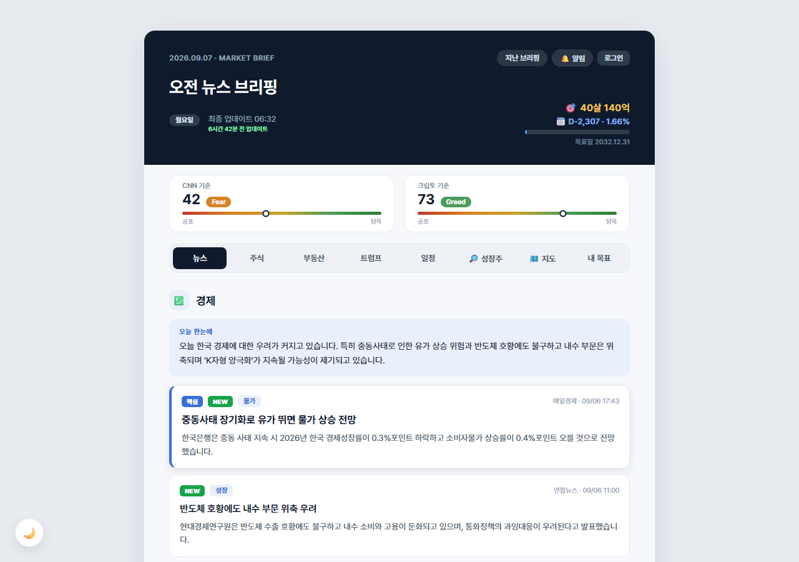
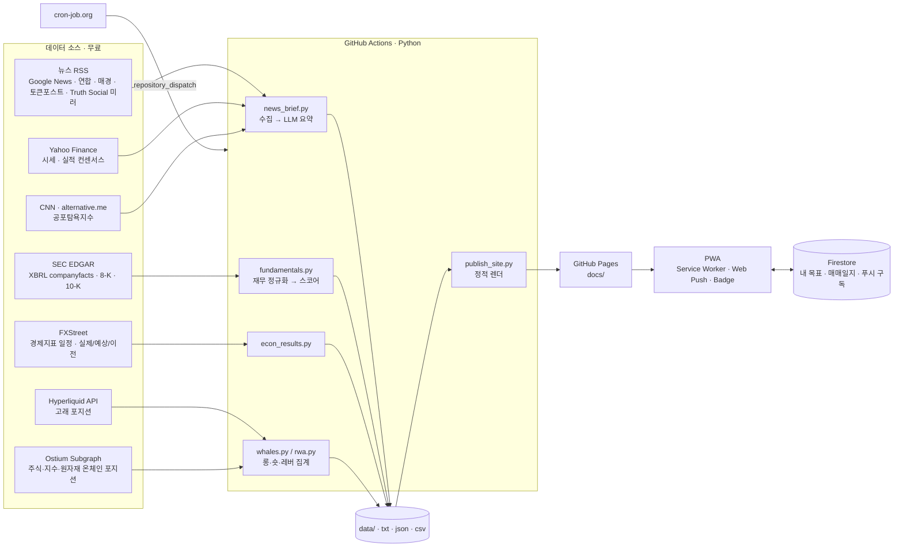

# MARKET BRIEF — 서버 없이 돌아가는 경제 브리핑 데이터 파이프라인 & PWA

[](#기술-스택)
[](#스케줄링-신뢰성)
[](https://kkkkkijun.github.io/stock_news_mailer/)
[](#ax-llm을-어디에-어떻게-썼나)
[](#pwa--알림)

> **라이브:** https://kkkkkijun.github.io/stock_news_mailer/
> 매일 06:30 / 17:00(KST) 국내외 경제·해외주식·코인·부동산 뉴스를 수집·요약해 정적 웹앱으로 발행하고, 폰에 푸시로 알려주는 **무인 운영 파이프라인**입니다.
> 서버 0대, 월 운영비 약 $2~6(LLM 호출만 유료), 나머지 데이터 소스 15개는 전부 무료 공개 API/RSS.



---

## 목차
1. [왜 만들었나](#왜-만들었나)
2. [한눈에 보는 숫자](#한눈에-보는-숫자)
3. [아키텍처](#아키텍처)
4. [데이터 파이프라인 (Data Engineering)](#데이터-파이프라인-data-engineering)
5. [분석 로직 (Data Analysis)](#분석-로직-data-analysis)
6. [AX: LLM을 어디에, 어떻게 썼나](#ax-llm을-어디에-어떻게-썼나)
7. [운영 중 겪은 문제와 해결](#운영-중-겪은-문제와-해결)
8. [기술 스택](#기술-스택)
9. [실행 방법](#실행-방법)
10. [저장소 구조](#저장소-구조)
11. [로드맵](#로드맵)

---

## 왜 만들었나

매일 아침 뉴스·실적·경제지표·온체인 포지션을 여러 사이트에서 따로 확인하는 시간을 없애고 싶었습니다.
요구사항은 세 가지였습니다.

- **자동**: 사람이 손대지 않아도 정시에 수집 → 요약 → 발행 → 알림까지 끝난다.
- **저비용**: 상시 서버 없이, 유료 API 최소화. (실제 월 $2~6)
- **근거 유지**: LLM 요약이라도 원문 링크·수치 출처를 잃지 않는다.

처음엔 이메일 발송 스크립트 하나였고, 운영하면서 정적 사이트 → PWA → 실적/재무 분석 → 온체인 포지션 지도 → 경제지표 결과 반영으로 확장했습니다.

## 한눈에 보는 숫자

| 항목 | 값 |
|---|---|
| 자동 실행 | 뉴스 브리핑 2회/일 · 실적 리프레시 4회/일 · 포지션 지도 1회/시간 |
| 데이터 소스 | 15개 (RSS 6종, 공개 API 9종) — 전부 무료, 인증키 필요 없는 것 위주 |
| 유료 구간 | OpenAI `gpt-4o-mini` 요약·번역·리포트 생성만 (월 약 $2~6) |
| 인프라 | GitHub Actions(실행) + GitHub Pages(호스팅) + Firestore(개인 데이터·푸시 구독) + cron-job.org(정시 트리거) |
| 코드 | Python 약 5,800줄 · JavaScript 약 850줄 |
| 산출물 | 정적 HTML/JSON (docs/), 브리핑 원문 아카이브 (data/, 2회/일 누적) |

## 아키텍처



설계 원칙
- **수집과 렌더를 분리**: 수집 결과는 항상 파일(`data/`)로 남기고, 렌더는 그 파일만 읽습니다. 그래서 `rebuild_all()`로 **LLM 호출 없이** 과거 90회분 페이지를 언제든 재생성할 수 있습니다(멱등).
- **부분 실패 격리**: 섹션(경제·코인·부동산·트럼프·실적·지도) 단위로 `try/except`. 소스 하나가 죽어도 그날 브리핑은 나갑니다. LLM 키가 없으면 헤드라인 나열로 폴백.
- **정적 산출물**: 서버 없이 JSON+HTML만 배포. 클라이언트(브라우저)가 `whales.json`·`rwamap.json`·`prices.json`을 읽어 렌더합니다.

## 데이터 파이프라인 (Data Engineering)

### 모듈별 역할

| 모듈 | 입력 | 처리 | 출력 |
|---|---|---|---|
| `main.py` | 환경변수, 아래 모듈 | 오케스트레이션(수집→요약→발행→푸시), `refresh` 모드(LLM 없이 실적/시세만) | `docs/index.html`, 푸시 |
| `news_brief.py` (+ `topic_briefing.py`, `realestate_briefing.py`, `trump_briefing.py`) | Google News RSS + 언론사 RSS | 발견(폭넓은 쿼리) → 근거(언론사 리드 문단) → 2단계 요약. 주제 모듈은 **설정만** 담고 로직은 공유 | 섹션 텍스트 |
| `fundamentals.py` | SEC XBRL companyfacts, 10-K | 태그 드리프트 보정, Q4 유도(연간−3분기), TTM, 성장 스코어 | `data/fundamentals.json`, `data/qual_cache.json` |
| `econ_results.py` | FXStreet 캘린더 API | 높음(HIGH) 지표만, CSV `Id`와 API `id` **정확 매칭**, 단위(`%`,`$`)·배수(`K/M/B`) 조립 | `data/econ_results.json` |
| `whales.py` | Hyperliquid leaderboard · clearinghouseState | 상위 90 지갑 선별(자산+누적 PnL) → 코인별 롱/숏/레버 집계 | `docs/whales.json` |
| `rwa.py` | Ostium 서브그래프(Arbitrum) | 1,000건 페이지네이션, `USD = collateral/1e6 × leverage/100`, 카테고리 분류(주식·지수·원자재·암호화폐), 외환·채권 제외 | `docs/rwamap.json` |
| `publish_site.py` | `data/*` | 서버사이드 HTML 렌더(UTC→KST, 탭·아카이브·일정·지도·성장주) | `docs/**/*.html` |
| `store.py` | `data/*.txt`, `*.quotes.json` | 브리핑 원문을 SQLite로 색인하는 **파생 인덱스**(원 파이프라인 무변경) | `data/briefings.db` |
| `push_send.py` | Firestore `push_subs`, VAPID 키 | Web Push 발송, 404/410 구독 자동 정리 | 폰 알림 + 배지 |
| `docs/goal-app.js` | Firestore(사용자별) | 입출금·매매 기록, **FIFO 로트 매칭**으로 실현손익·승률·손익비·평균보유일, 현금 비중 | 내 목표 탭 |

### 스케줄링 신뢰성
GitHub Actions의 `schedule` 크론은 best-effort라 **2~6시간 지연·누락**이 실제로 발생했습니다.
해결: 외부 크론(cron-job.org, 무료) → GitHub `repository_dispatch` → 워크플로 실행. 뉴스 브리핑은 이 경로로만 돌고, 워크플로의 `schedule:`은 제거했습니다.

```yaml
on:
  workflow_dispatch:
  repository_dispatch:
    types: [news-briefing]
```

### 데이터 품질 장치
- **XBRL 태그 드리프트**: 같은 회사도 연도에 따라 `Revenues` ↔ `RevenueFromContractWithCustomer…` 태그가 바뀝니다. 후보 태그 중 **가장 최신 종료일을 가진 태그**를 고르도록 `_pick()`을 짰습니다. (NVDA 매출이 $3,105M(2020 태그)로 잡히던 오류 → $81,615M로 정정)
- **Q4 결측**: 10-K에는 연간만 있어 4분기 흐름값이 비는 문제를 `연간 − (Q1+Q2+Q3)`로 유도.
- **시간 기준 분리**: 브리핑 본문은 "발행 시각", 일정·D-day 등 시간 의존 UI는 "실제 현재 시각"으로 렌더. 재빌드 때 결과가 과거로 되돌아가는 버그를 이렇게 막았습니다.
- **소스 검증 선행**: 새 소스는 코드 전에 실호출로 스키마·인증·경계값을 확인(Ostium 1,603포지션 집계 검증, FXStreet id 매칭 검증).

## 분석 로직 (Data Analysis)

### 성장주 스크리너 (SEC 재무 기반)
"우량주가 아니라 **성장 궤도**에 있는 기업"을 찾는 것이 목적이라 성장 축에 가중을 둡니다.

| 축 | 지표 | 가중 |
|---|---|---|
| 성장 (g) | 매출 YoY (25%↑ 녹색 / 12%↑ 노랑) | **0.42** |
| 수익성 (p) | 영업이익률, 적자면 **적자폭 개선 속도** | 0.20 |
| 재무 (b) | 순현금/순부채, 부채 증가 시 CapEx 브리지 | 0.16 |
| 지속성 (s) | 주식 희석률, FCF | 0.22 |

`score = 0.42g + 0.20p + 0.16b + 0.22s`, 단 **저성장 게이트**(YoY < 12% → 최대 50점, < 22% → 최대 72점)로 수익성·재무 만점인 대형 우량주가 상위권을 점하지 못하게 했습니다.
해자(moat)는 처음 LLM 주관 점수를 썼다가 값이 85점 근처로 몰리는 문제가 있어, **매출총이익률 수준·안정성·추세**로 만든 정량 프록시로 교체했습니다(설명 가능성 확보).

### 경제지표 결과 표기 원칙
발표된 높음 지표는 `실제 / 예상 / 이전`과 함께 `▲ 상회 / ▼ 하회 / = 부합`을 붙입니다.
이는 **예상치 대비 숫자 방향**일 뿐 좋다·나쁘다 판단이 아님을 UI에 명시했습니다(실업률 ▲는 악화). 소스가 주는 `isBetterThanExpected`가 자주 비어 있어 방향만 표기하는 쪽이 정직하다고 판단했습니다.

### 온체인 포지션 지도
- 암호화폐: Hyperliquid 상위 90 지갑의 실제 포지션(고래).
- 주식·지수·원자재: Ostium 전체 오픈 포지션(고래 필터 아님, 라벨로 구분).
- 자산별 **순롱 비율 × 평균 레버리지**를 4분면 버블맵(d3-force)으로 시각화. 색은 국내 관례(빨강=롱/상승, 파랑=숏/하락).

### 매매일지
FIFO 로트 매칭으로 청산 매매를 자동 생성하고 실현손익·승률·손익비·평균수익률·평균보유일을 계산합니다. 평균단가·실현손익은 체결가 기준(수수료 별도)으로 증권사 표기와 일치시켰습니다.

## AX: LLM을 어디에, 어떻게 썼나

| 용도 | 모델 | 가드레일 |
|---|---|---|
| 뉴스 요약(오늘 한눈에 / 핵심 / 흐름·전망) | gpt-4o-mini | 언론사 리드 문단을 근거로 제공, 원문 링크·출처·시각 유지, 실패 시 헤드라인 폴백 |
| 트럼프 발언 번역·요약 | gpt-4o-mini | "트럼프의 주장"임을 명시, 광고·재게시 제거, 단일 소스 실패 시 섹션 비움 |
| 실적 리포트 생성 | gpt-4o-mini | SEC 8-K 보도자료 원문 + Yahoo 컨센서스 수치를 입력, 실제/예상 비교는 코드로 계산 |
| 10-K 정성 분석(사업·확장성·리스크) | gpt-4o-mini | JSON 스키마 강제, **캐시**로 종목당 1회만 호출 |

원칙: **숫자는 코드가, 문장은 LLM이.** 점수·비율·상회/하회 판정처럼 검증 가능한 것은 LLM에 맡기지 않았고, LLM 산출물은 항상 원문 링크와 함께 보여줍니다. 비용은 사용량 한도로 상한을 걸어 운영합니다.

## 운영 중 겪은 문제와 해결

| 문제 | 원인 | 해결 |
|---|---|---|
| 알림은 왔는데 사이트가 갱신되지 않음 | 로컬의 오래된 워크플로 파일이 원격을 덮어써 "발행 커밋" 스텝이 사라짐 | 워크플로 복구 + 생성물 커밋은 소스 커밋과 분리하는 규칙 |
| 아침 브리핑이 2~6시간 늦음 | GitHub `schedule` 크론의 best-effort 특성 | 외부 크론 → `repository_dispatch` |
| NVDA 매출이 30억 달러로 표시 | XBRL 태그 드리프트(구 태그의 2020년 값) | 최신 종료일 기준 태그 선택 |
| 실적 리프레시 후 지표 결과가 사라짐 | 재빌드가 저장된 브리핑 시각을 `now`로 재사용 | 시간 의존 블록만 실시간 계산 |
| 다른 계정이 기여자에 표시 | 커밋 author 이메일 오설정 | `filter-branch`로 이력 정정 + 자격증명 헬퍼 정리 |

## PWA · 알림
- `manifest.webmanifest` + `sw.js`(network-first, 오프라인 시 캐시 폴백)로 홈 화면 설치.
- iOS 안전영역(`env(safe-area-inset-*)`) 대응.
- Web Push(VAPID) + Badge API: 브리핑 발행 시 배지·팝업. 구독은 Firestore에 저장, 🔔 버튼으로 토글.

## 기술 스택
Python 3 · feedparser · requests · trafilatura · pypdf · Pillow · pywebpush · OpenAI SDK
GitHub Actions · GitHub Pages · Firebase Auth/Firestore · Service Worker · Web Push · d3-force · SQLite

## 실행 방법

```bash
pip install -r requirements.txt
```

환경변수

| 변수 | 용도 | 필수 |
|---|---|---|
| `OPENAI_API_KEY` | 요약·번역·리포트 | 선택(없으면 헤드라인 폴백) |
| `VAPID_PRIVATE_KEY`, `VAPID_SUBJECT` | Web Push | 푸시 사용 시 |
| `EMAIL_USER`, `EMAIL_PASS`, `SEND_EMAIL` | 이메일 발송(기본 꺼짐 `0`) | 선택 |
| `PUBLISH_SITE` | 정적 사이트 발행(기본 `1`) | |
| `SITE_URL` | 푸시에 담을 링크 | |
| `DRY_RUN=1` | 발송·발행 없이 본문만 출력 | 테스트 |

```bash
python main.py                 # 전체 브리핑: 수집 → 요약 → 발행 → 푸시
python main.py refresh         # LLM 없이 실적·시세·보고서만 갱신 후 재렌더
python rwa.py refresh          # 주식·지수·원자재 포지션 스냅샷
python whales.py refresh       # Hyperliquid 고래 스냅샷
python econ_results.py         # 경제지표 실제/예상/이전 수집
```

GitHub Actions에서는 위 명령을 `send_email.yml`(브리핑) · `earnings-refresh.yml`(실적) · `map-refresh.yml`(지도)이 나눠 실행하고, 변경된 `docs/`·`data/`를 봇 계정으로 커밋합니다. 내 목표 탭은 Firebase 프로젝트(Auth + Firestore, 사용자별 보안 규칙)가 필요합니다.

## 저장소 구조

```
.
├── main.py                 # 오케스트레이션 · refresh 모드 · 푸시
├── news_brief.py           # 뉴스 수집/요약 공통 엔진
├── topic_briefing.py       # 경제·코인시장 (설정)
├── realestate_briefing.py  # 부동산 (설정)
├── trump_briefing.py       # Truth Social 번역·요약
├── fundamentals.py         # SEC XBRL → 성장 스코어 · 10-K 정성
├── econ_results.py         # FXStreet 지표 결과
├── whales.py / rwa.py      # 온체인 포지션 집계
├── publish_site.py         # 정적 HTML 렌더
├── store.py                # SQLite 파생 인덱스
├── push_send.py            # Web Push
├── scheduler.py            # (선택) 상시 서버용 APScheduler
├── data/                   # 브리핑 원문·시세·재무·지표 (수집 결과)
├── docs/                   # GitHub Pages 산출물 · PWA · goal-app.js · flags/
└── .github/workflows/      # send_email · earnings-refresh · map-refresh
```

## 로드맵
- 포지션 **움직임 피드**: 시간별 스냅샷 diff를 DB에 남겨 "누가 언제 무엇을 늘렸나" 표시
- 지도 갱신도 외부 크론으로 이관
- `store.py` 색인을 이용한 브리핑 검색·전일 대비 변화 UI
- 커스텀 도메인

---

개인 학습·사용 목적의 프로젝트입니다. 뉴스 요약과 수치는 투자 조언이 아닙니다.
